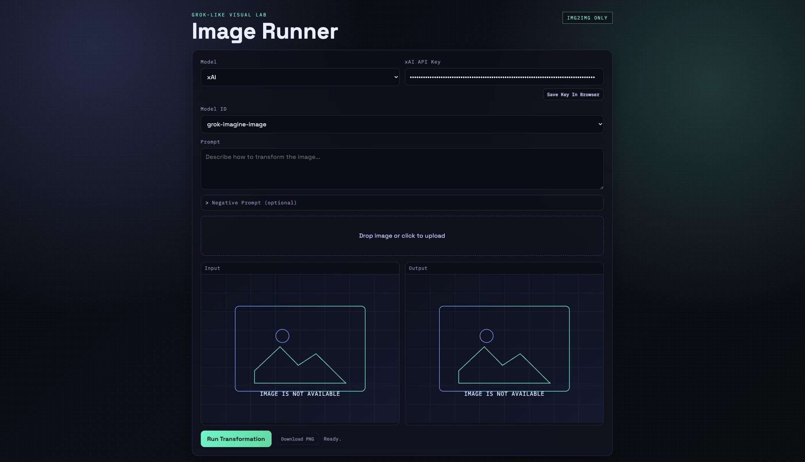

# Image Runner

A compact desktop-style AI image-to-image app for macOS, built with Flask, pywebview, and xAI image models.

Image Runner is designed around one focused flow: upload an image, write a prompt, generate a new variation, inspect the result, and export it as a standard PNG.

## Highlights

- Native macOS app window powered by `pywebview`
- xAI image workflow with a simple model switcher
- Supported model IDs:
  - `grok-imagine-image`
  - `grok-imagine-image-pro`
- Drag-and-drop upload
- Click-to-enlarge previews
- Local API key saving in the app/browser storage
- PNG export with automatic `-regenerated` filename suffix
- PyInstaller-based `.app` packaging included

## Preview

The UI is styled as a dark, terminal-inspired image lab with:

- dual input/output preview panels
- fullscreen image preview on click
- collapsible advanced prompt controls
- built-in placeholder preview artwork



## Stack

- Python
- Flask
- pywebview
- PyInstaller
- Vanilla HTML, CSS, and JavaScript

## Requirements

- macOS
- Python 3.9 or newer
- An xAI API key with access to the selected image model

## Quick Start

```bash
python3 -m venv .venv
./.venv/bin/python -m pip install -r requirements.txt
./.venv/bin/python app.py
```

Open:

```text
http://127.0.0.1:5000
```

## Run As A Desktop App

Launch the embedded native window locally:

```bash
./.venv/bin/python desktop.py
```

This opens the interface inside an app window instead of an external browser.

## Build The macOS App

```bash
chmod +x build_app.sh
./build_app.sh
```

Generated output:

```text
dist/ImageRunner.app
```

## Usage Flow

1. Enter your xAI API key.
2. Choose a model ID.
3. Drag in an image or click to upload.
4. Enter a prompt.
5. Generate a new image.
6. Click either preview to enlarge it.
7. Download the result as PNG.

## Project Structure

```text
image-runner/
├── app.py
├── desktop.py
├── build_app.sh
├── ImageRunner.spec
├── requirements.txt
├── templates/
│   └── index.html
├── static/
│   ├── app.js
│   ├── styles.css
│   └── default-preview.svg
└── README.md
```

## Notes

- API keys are stored locally in the webview/browser environment using `localStorage`.
- Downloaded results are normalized to standard PNG before saving.
- Build artifacts such as `dist/` and `build/` are excluded by `.gitignore`.

## Roadmap

- model discovery from the upstream API
- custom app icon and DMG packaging
- richer generation settings in the UI
